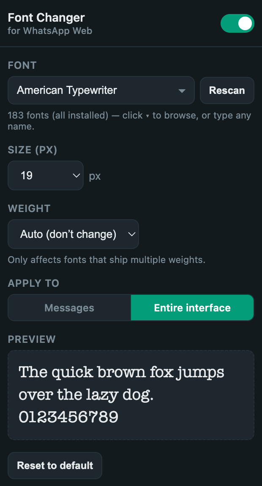
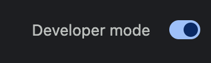

# Font Changer for WhatsApp Web

Change the **font**, **size**, and **weight** of the text on
[web.whatsapp.com](https://web.whatsapp.com) — and have your choice remembered every time you open it.


A tiny, dependency-free Chromium extension (works in **Chrome**, **Brave**, **Edge**, and other
Chromium browsers). It reads the fonts installed on *your* machine, lets you pick one from a
searchable dropdown, and applies it live — no page reload, nothing sent anywhere.

<p align="center">
  
</p>

## Features

- 🔤 **Any installed font** — pulls your complete system font list (`chrome.fontSettings.getFontList`)
  into a searchable dropdown, each name previewed in its own typeface. Or just type a font name.
- 📏 **Size** — 8–24 px, or leave WhatsApp's default.
- 🅱️ **Weight** — Auto, or force 100–900 (WhatsApp's own bold text is preserved).
- 🎯 **Scope** — apply to just the **messages** or the **entire interface**.
- 🔀 **On/off toggle** — flip back to WhatsApp's default instantly without losing your settings.
- 💾 **Remembered** — saved with `chrome.storage.sync`, so it persists across restarts and syncs
  across your devices when you're signed into the browser.
- ⚡ **Live** — changes apply immediately to any open WhatsApp Web tab.

## Install

### From the Chrome Web Store

<!-- Add the store link once published -->
_Coming soon._

### From source (GitHub)

Works the same in Chrome, Brave, and Edge.

1. **Get the code** — either:
   - Download the ZIP: **Code ▸ Download ZIP** on the GitHub page, then unzip it; **or**
   - Clone it:
     ```bash
     git clone https://github.com/datcrack/font-changer-for-whatsapp-web.git
     ```
2. Open your browser's extensions page:
   - Chrome: `chrome://extensions`
   - Brave: `brave://extensions`
   - Edge: `edge://extensions`
3. Turn on **Developer mode** (toggle in the top-right, or left sidebar on Edge).

   
4. Click **Load unpacked** and select the folder you just downloaded/cloned
   (the one containing `manifest.json`).
5. Open **web.whatsapp.com** and click the extension's icon to open the control panel.

The extension stays installed across restarts. To update, `git pull` (or re-download) and click the
**↻ reload** icon on the extension's card.

## Usage

Open **web.whatsapp.com**, click the extension icon, then:

- **Font** — click **▾** to browse your installed fonts (type to filter), or type any exact name.
  **Rescan** re-reads your fonts after you install new ones.
- **Size (px)** — pick 8–24, or **Default**.
- **Weight** — **Auto**, or 100–900. Note: only fonts that ship multiple weights respond; single-weight
  display fonts (e.g. Chicago) have just one weight.
- **Apply to** — **Messages** or **Entire interface**.
- **On/off switch** (top-right) and **Reset to default** as needed.

Everything applies live and is saved automatically.

## Permissions & privacy

This extension **collects nothing and sends nothing** — there are no analytics, no network requests,
no external servers. Everything runs locally in your browser. It requests only what it needs:

| Permission | Why |
|---|---|
| `storage` | Save your 4 settings (font, size, weight, scope) so they persist. |
| `fontSettings` | Read your installed-font list to populate the dropdown. |
| `host: https://web.whatsapp.com/*` | Apply the font on WhatsApp Web only. |

No other sites are touched, and no font files are downloaded — it only references fonts already
installed on your machine.

## How it works

- `content.js` runs on `web.whatsapp.com`, reads your settings, and injects a **constructed
  stylesheet** via `document.adoptedStyleSheets`. This bypasses WhatsApp's strict
  Content-Security-Policy (unlike an injected `<style>` tag) and applies `font-family` / `font-size` /
  `font-weight` with `!important`.
- Scope roots: **Messages** = `#main` (the open conversation), **Entire interface** = `#app`. Icons
  and emoji (`[data-icon]`, `.emoji`, `svg`, `img`) are excluded so glyphs aren't broken, and
  `<b>`/`<strong>` are excluded from the weight override so intentional bold survives.
- The popup lists fonts with `chrome.fontSettings.getFontList()` (a privileged extension API that,
  unlike the web `queryLocalFonts()` API, isn't blocked by WhatsApp's `Permissions-Policy`). If that's
  ever unavailable it falls back to measurement-based detection over a bundled name list (`fonts.js`).
- The popup writes settings to `chrome.storage.sync`; the content script listens via
  `chrome.storage.onChanged` for instant live updates.

## A note for Brave users

Brave randomizes font metrics to resist fingerprinting, which can hide fonts from the scan and stop
some non-system fonts from *rendering*. System/web-safe fonts always work. For best results with
unusual fonts: click the **Brave Shields** icon on `web.whatsapp.com` → set **Block fingerprinting**
to **off** → reload. The popup shows this tip only when it detects Brave.

## Project structure

```
manifest.json   # MV3 manifest (permissions, content script, popup)
content.js      # applies the font/size/weight on web.whatsapp.com
popup.html      # control panel UI
popup.css       # control panel styles
popup.js        # popup logic: font list, custom dropdown, storage
fonts.js        # fallback candidate font-name list (measurement detection)
icons/          # toolbar icons
```

No build step, no dependencies — plain HTML/CSS/JS.

## Contributing

Issues and pull requests welcome. WhatsApp occasionally changes its obfuscated class names; if the
font stops applying, the scope roots are isolated in `SCOPE_ROOTS` at the top of `content.js`.

## License

[MIT](LICENSE) © 2026 Murat Deligoz

## Disclaimer

This is an independent, unofficial project. It is **not affiliated with, endorsed by, or sponsored by
WhatsApp or Meta Platforms, Inc.** "WhatsApp" is a trademark of Meta Platforms, Inc., used here only
nominatively to describe what this extension works with.
